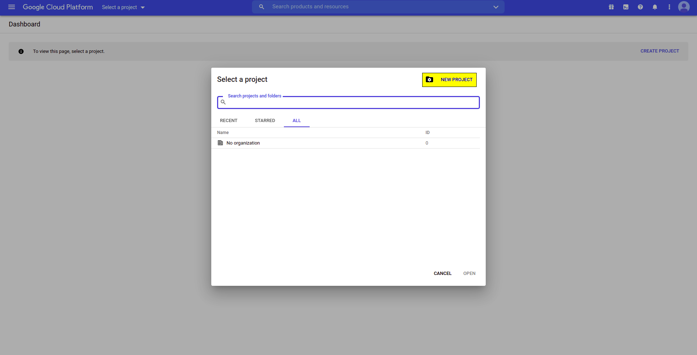
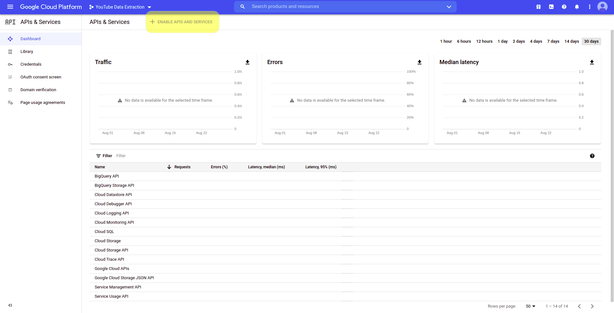
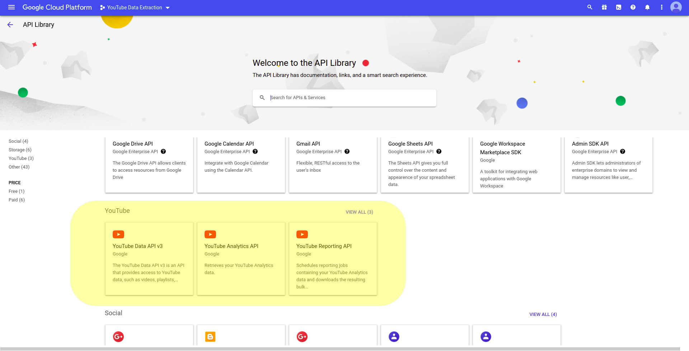
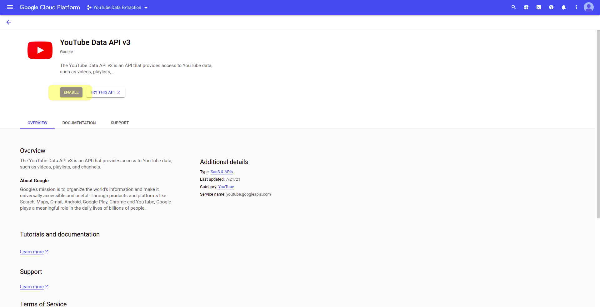
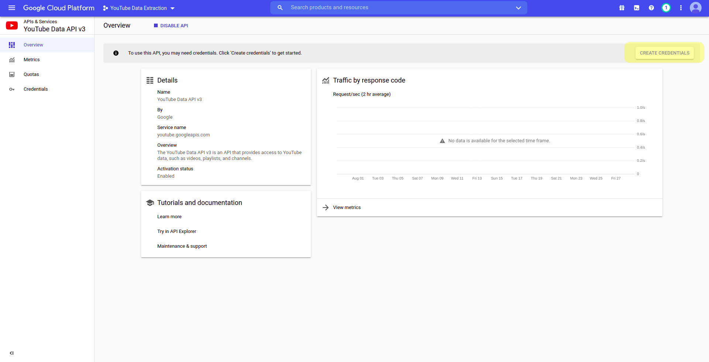
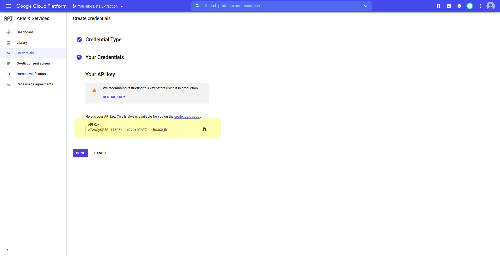
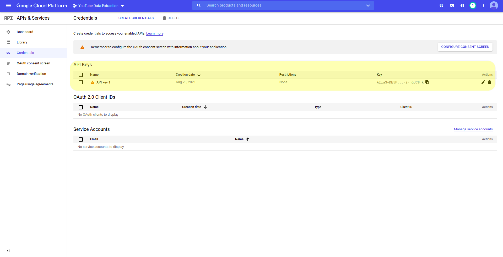

# YouTube's Live Chat Extractor

**_Youtube's Live Chat Extractor_** is a Python tool to get the chat messages details from an ongoing YouTube's live video (author's channel ID, author's channel name, publish date and message content). The messages retrieval is made via [Google API Python client library](https://github.com/googleapis/google-api-python-client) and [YouTube Data API v3](https://developers.google.com/youtube/v3).

## Prerequisites

It is required to have [Python 3.8](https://www.python.org/) installed on your device. I strongly recommend the [Anaconda Python distribution](https://www.anaconda.com/). Also, we need to obtain an API key and install the [Google API Python Client Library](https://github.com/googleapis/google-api-python-client).

### How to get an API key

First of all, you need to have a Google account. If you don't have it, you can register [here.](https://accounts.google.com/signup/v2/webcreateaccount?continue=https%3A%2F%2Fmyaccount.google.com%3Futm_source%3Daccount-marketing-page%26utm_medium%3Dcreate-account-button&flowName=GlifWebSignIn&flowEntry=SignUp)

Once you have signed up, you need to go to [Google Cloud Platform](https://console.cloud.google.com/).

Then, you need to create a new project. Click on `Select a project` tab near the upper left corner, and then click on `NEW PROJECT`:




You will be redirected to the **New Project** page. Name your project, for example as _YouTube Data Extraction_ and click on `CREATE`:


After that, you will be redirected to the project's dashboard. Note the `Select a project` tab now have the project name, than means you have the **_YouTube Data Extraction_** project selected. In case you have more projects, you can select them from this tab.

Now, we need to enable the API in this project. Click on `Explore and enable APIs` option within `Getting Started` card in the lower left corner of the dashboard:


After that, you will be redirected to **APIs & Services** page. Here, click on `+ ENABLE APIS AND SERVICES` at the top of the page:



Then, you will be redirected to the **API Library**. Scroll down a little bit the options and you will find YouTube's APIs. For the purposes of this article, you only need the one named `YouTube Data API v3`, so click on it:



**YouTube Data API v3** information will be displayed, you just need to click on `ENABLE`:



Next, you will be redirected to the **API Overview page**. At the top you will see the message "_To use this API, you may need credentials. Click 'Create credentials' to get started_". Click on `CREATE CREDENTIALS` at the top right corner of the page just next to the message:



The **Create credentials** form will be shown. Select `YouTube Data API v3` in the **Select an API** dropdown menu and check the `Public data` radio button, then click on `NEXT`:


Finally, your API key will be displayed. This key is needed in order to use the API in your programs:



You can always check it from the **Credentials screen**. You can access this screen from the hamburger menu at the top left corner of the Google Cloud Platform interface




### How to install Google API Python Client Library

To perform this installation we just need to type a single instruction in the command line:

**Anaconda**

```bash
conda install -c conda-forge google-api-python-client
```

**Pip**

```bash
pip install google-api-python-client
```

## Usage

The script must be executed from the command line as follows:

```bash
python livechatextractor.py -k <your_API_key> -i <video_id> -o <output_file_name> -v <[0|1]>
```

Where

- `-k / --apikey` (string): A valid YouTube Data API v3 key.

- `-i / --videoid` (string): Id of the live video. For example, if the complete video's URL is: https://www.youtube.com/watch?v=N-80sVfbAno, then you need to set `-i` parameter as **N-80sVfbAno** (string assigned to 'v' URL parameter).

* `-o / --outputfile` **(Optional)** (string): Desired name for the output file. If not given, the messages will be saved as `results.csv`. The file will be stored in the current directory.

* `-v / --verbose` **(Optional)** (int): Whether you want chat messages to be displayed on console or not (0=no ; 1=yes by default).

The stop criteria is one of the following:

- The live video ends.
- The 10,000 API quota daily credits are exceeded ([more details here](https://developers.google.com/youtube/v3/guides/quota_and_compliance_audits)).
- Users keyboard interruption.

Each case is properly handled. When one of the previous events happens, all retrieved messages will be stored immediately in a `.csv` file with columns `authorChannelId`, `authorChannelName`, `messagePublishDate` and `messageContent`.
